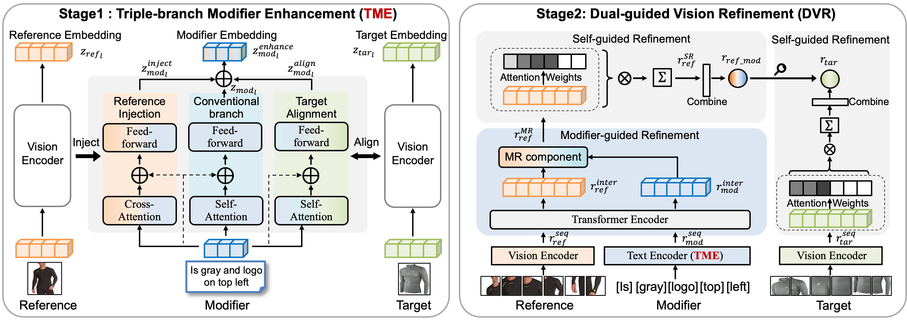

# **FashionERN: Enhance-and-Refine Network for Composed Fashion Image Retrieval**

This is the source code of our AAAI 2024 paper "[FashionERN: Enhance-and-Refine Network for Composed Fashion Image Retrieval](https://ojs.aaai.org/index.php/AAAI/article/view/27885/27795)".



- [**FashionERN: Enhance-and-Refine Network for Composed Fashion Image Retrieval**](#fashionern-enhance-and-refine-network-for-composed-fashion-image-retrieval)
  - [Installation](#installation)
  - [Datasets](#datasets)
  - [Quick Start](#quick-start)
  - [Citation](#citation)
  - [Contact](#contact)
  - [Acknowledgements](#acknowledgements)

## Installation

```bash
conda env create -f environment.yml
source activate Fashion
```

## Datasets

Our model is evaluated on *FashionIQ*, *Shoes*, *Fashion200k* and *CIRR* datasets.

The download homepages for these datasets are listed as follows.

- [FashionIQ](https://github.com/XiaoxiaoGuo/fashion-iq)
- [Shoes](https://vision.cs.utexas.edu/whittlesearch/)
- [Fashion200k](https://github.com/xthan/fashion-200k)
- [CIRR](https://github.com/Cuberick-Orion/CIRR)

## Quick Start

- **dataloader**: Contains loading files for 4 commonly used datasets.
- **losses**: Contains the ```loss.py``` file specific to the paper, along with an ```others``` folder that includes additional commonly used loss functions.
- **models**: Contains the ```FashionERN``` model. The ```others``` folder within models gathers relatedmodels that may be compared.
- **run**: Contains files corresponding to the training (train), validation (valid), and testing (test) phases.
- **utils**: Comprises of utility functions that support various tasks within the project.

Note: Due to **Kuaishou's code restrictions**, we are unable to open-source the TME module used internally, :(. However, we will make it as easy as possible to follow our work and use a vanilla CLIP single branch to ensure the approach can run. The training code is built on PyTorch with DistributedDataParallel (DDP). We pretrain the framework with 8 V100 GPUs.

```python
# FashionIQ (ResNet setting)
python -u -m torch.distributed.launch --nproc_per_node=8 --master_addr="127.0.0.1" --master_port=22223 run/train_fiq.py --dataset=fashionIQ --lr=4e-5 --batch-size=1024 --num-epochs=300 --clip-model-name="RN50x4" --save-training 

# FashionIQ (ViT setting)
python -u -m torch.distributed.launch --nproc_per_node=8 --master_addr="127.0.0.1" --master_port=22223 run/train_fiq.py --dataset=fashionIQ --lr=2e-6 --batch-size=512 --num-epochs=300 --clip-model-name="ViT-B-16" --save-training 

# Shoes (ResNet setting)
python -u -m torch.distributed.launch --nproc_per_node=8 --master_addr="127.0.0.1" --master_port=22223 run/train_shoes.py --dataset=Shoes --lr=4e-5 --batch-size=512 --num-epochs=300 --clip-model-name="RN50x4" --save-training 

# Fashion200k (ResNet setting)
python -u -m torch.distributed.launch --nproc_per_node=8 --master_addr="127.0.0.1" --master_port=22223 run/train_200k.py --dataset=Fashion200k --lr=3e-5 --batch-size=1024 --num-epochs=300 --clip-model-name="RN50x4" --save-training 

# CIRR (ResNet setting)
python -u -m torch.distributed.launch --nproc_per_node=8 --master_addr="127.0.0.1" --master_port=22223 run/train_cirr.py --dataset=CIRR --lr=4e-5 --batch-size=1024 --num-epochs=300 --clip-model-name="RN50x4" --save-training 
```

The test code is shown as follow.

```python
# FashionIQ (ResNet setting)
python run/test_fiq.py --dataset=fashionIQ --clip-model-name="RN50x4" --clip-path="" --fusion-model-path=""

# FashionIQ (ViT setting)
python run/test_fiq.py --dataset=fashionIQ --clip-model-name="ViT-B-16" --clip-path="" --fusion-model-path=""

# FashionIQ (ResNet VAL setting)
python run/test_val.py --dataset=fashionIQ --clip-model-name="RN50x4" --clip-path="" --fusion-model-path=""

# Shoes (ResNet setting)
python run/test_shoes.py --dataset=shoes --clip-model-name="RN50x4" --clip-path="" --fusion-model-path=""

# Fashion200K (ResNet setting)
# As with previous work, need to set the absolute path at the beginning of 'dataloader/fashion200k_patch.py'.
python run/test_200k.py --dataset=fashion200k --clip-model-name="RN50x4" --clip-path="" --fusion-model-path=""

# CIRR (ResNet setting)
python run/test_cirr.py --dataset=CIRR --clip-model-name="RN50x4" --clip-path="" --fusion-model-path=""
```

## Citation

If you find our work helps, please cite our paper.

```bibtex
@inproceedings{chen2024fashionern,
  title={FashionERN: Enhance-and-Refine Network for Composed Fashion Image Retrieval},
  author={Chen, Yanzhe and Zhong, Huasong and He, Xiangteng and Peng, Yuxin and Zhou, Jiahuan and Cheng, Lele},
  booktitle={Proceedings of the AAAI Conference on Artificial Intelligence},
  volume={38},
  number={2},
  pages={1228--1236},
  year={2024}
}
```

## Contact

This repo is maintained by [Yanzhe Chen](https://github.com/ChenAnno). Questions and discussions are welcome via `chenyanzhe@stu.pku.edu.cn`.

## Acknowledgements

Our code references the following projects. Many thanks to the authors.

- [VAL](https://github.com/yanbeic/VAL)
- [CLIP4Cir](https://github.com/ABaldrati/CLIP4Cir)
- [CLIP](https://github.com/openai/CLIP)
- [FAME-ViL](https://github.com/BrandonHanx/FAME-ViL)
- [open_clip](https://github.com/mlfoundations/open_clip)
